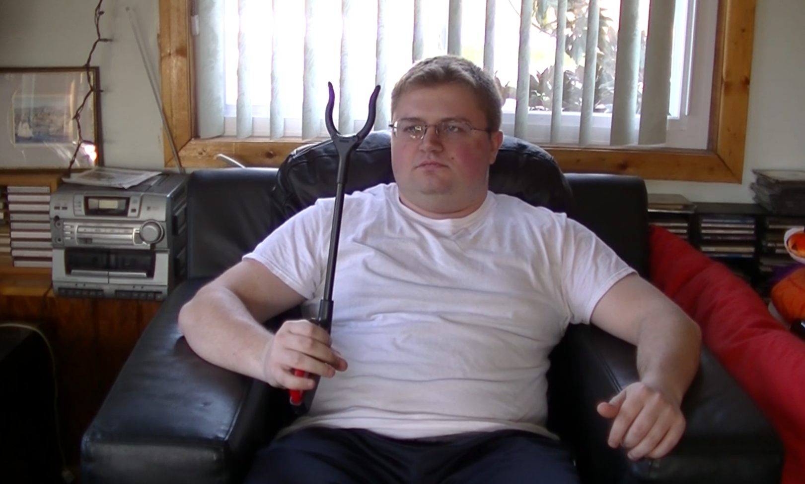

# Project 2: Continuous Control

### Introduction

In this project it is proposed to use an autonomous agent for use our arm to follow an sphere. A difference of A2C Actor-Critic, this problem has an continuous state and actions. For this reason is a better approach use **Continuous Actor-Critic** family like: DDPG.



In the first instance, we should try to formalize the problem proposed in one of RL.

| Variable name | Description                                                  |
| ------------- | ------------------------------------------------------------ |
| **state**     | A set of 33 sensors that describe the information of the current state. |
| **actions**   | A set of 4 continuous actions.                               |
| **reward**    | +0.1 if the agent follow a sphere.                           |

Once the problem is defined, we must remember that an RL problem is simply a **maximization problem.** In contrast the previous project, in this case we use a maximization problem that combine: Actor-Network and Critic-Network.


### Project structure

The project has estructured as following:

- **README.md**
- **Report.pdf**: Document that explain all implementation.
- **Continuous_Control.ipynb:** The continuous control project jupyter notebook.
- *code*: implementation of the DQN, agent, etc.
  - **agent.py**: Definition of the used agent.
  - **config.py**: Configuration of paths, pytorch device and hyperparameters.
  - **model.py**: Network architectures.
- *DDPG.py*: Pythin script to train an agent (similar than notebook). 
- *doc*: additional images, etc for readme.
- *envs*: location of the used environments.
  - *one*
  - *twenty*
- *checkpoints*: saved checkpoints during training:
  - *one*
  - *twenty*
- *models*: saved final models:
  - *one*
  - *twenty*

### Download Environment

For the correct operation of the program, you must download the environment where the agent will move. Both agents are valid. And you can choose which option by configuring the parameters in *Config.py -> SELECT_ENV*.

- **_Version 1: One (1) Agent_**
  - Linux: [click here](https://s3-us-west-1.amazonaws.com/udacity-drlnd/P2/Reacher/one_agent/Reacher_Linux.zip)
  - Mac OSX: [click here](https://s3-us-west-1.amazonaws.com/udacity-drlnd/P2/Reacher/one_agent/Reacher.app.zip)
  - Windows (32-bit): [click here](https://s3-us-west-1.amazonaws.com/udacity-drlnd/P2/Reacher/one_agent/Reacher_Windows_x86.zip)
  - Windows (64-bit): [click here](https://s3-us-west-1.amazonaws.com/udacity-drlnd/P2/Reacher/one_agent/Reacher_Windows_x86_64.zip)
- **_Version 2: Twenty (20) Agents_**
  - Linux: [click here](https://s3-us-west-1.amazonaws.com/udacity-drlnd/P2/Reacher/Reacher_Linux.zip)
  - Mac OSX: [click here](https://s3-us-west-1.amazonaws.com/udacity-drlnd/P2/Reacher/Reacher.app.zip)
  - Windows (32-bit): [click here](https://s3-us-west-1.amazonaws.com/udacity-drlnd/P2/Reacher/Reacher_Windows_x86.zip)
  - Windows (64-bit): [click here](https://s3-us-west-1.amazonaws.com/udacity-drlnd/P2/Reacher/Reacher_Windows_x86_64.zip)

Once downloaded, you must save it in **envs/(one|twenty)** depending on the version. If the version is different from Linux, you must modify the config.py paths to read them properly.

### Getting Started

1. Download the environment and put in the envs location.
2. Change the path ```code/config.py```  if your operative system is different than Linux.
3. Use ```jupyter notebook``` to view both projects. Or execute ``` python DDPG.py```.
